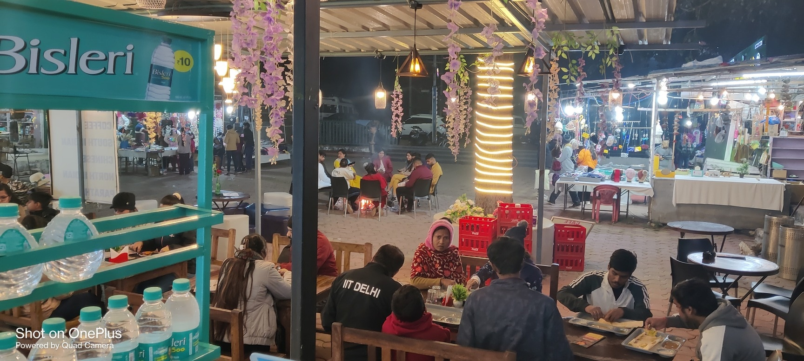

# Cafe Pachmarhi

### Premium, responsive & animated cafe experience

 
 

 

**Click the preview image or button above to open the complete website.**

## About

A premium, modern and fully responsive website for **Cafe Pachmarhi** — *A Single Use Plastic Free Zone*. The site includes animated sections, interactive menu browsing, gallery, WhatsApp, click-to-call contact, Google Maps directions and dedicated pages for the cafe experience.

## Highlights

- Fully responsive mobile, tablet and desktop layout
- Animated hero, loader and scroll interactions
- Interactive menu guide and search
- Cafe gallery and lightbox-style interactions
- WhatsApp and click-to-call integration
- Google Maps directions
- Multiple internal pages with GitHub Pages-safe navigation
- Static deployment through GitHub Actions

## Technology

Next.js • React • JavaScript • Tailwind CSS • Framer Motion • GSAP • Swiper

## Links

- **Live Website:** https://satitech-official.github.io/cafe-pachmarhi/
- **Repository:** https://github.com/satitech-official/cafe-pachmarhi

---

Built by **Sati Technologies** — *Code. Create. Elevate.*
